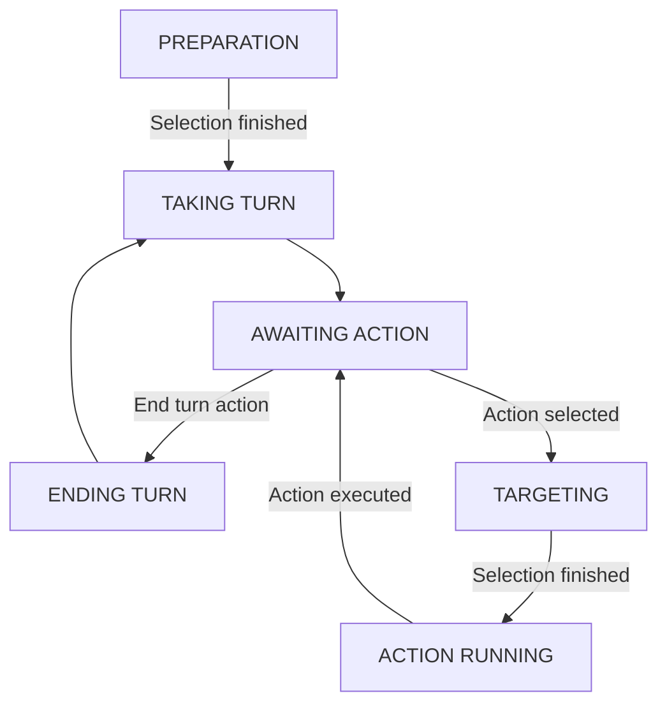

---
tags:
  - mechanical/combat
  - gameplay_design
---
## Features
Combat is handled by the [[BattleController]]. 
- [[Unit]]s make the core of the combat and should be the ones deciding victory at all times.
- Terrain exists to limit [[Unit]] movement. It should take at least 3 turns to reach the end of the map. 
- **TODO:** Events can happen during combat which will be telegraphed in some way. These influence how the combat is carried out and the player is warned before combat about them.

## States
- **PREPARATION:** **TODO** Allows selecting the [[Unit]]s that will participate and their position. The party screen is also available from here. Once exited, pass onto TAKING TURN
- **TAKING TURN:** Gets the [[Unit]] with the lowest delay and makes them take their turn. Then moves onto AWAITING ACTION
- **AWAITING ACTION:** Updates the action buttons so the player can make an input. Once an action is selected, a new UsageParamaters is created and passes onto TARGETING. 
  If the action to end the turn is used, pass onto ENDING TURN instead.
- **ENDING TURN:** Loops until any left-over actions have finished running, then ends the current [[Unit]]'s turn and pass onto TAKING TURN so a new one can start.
- **[[Ability Usage|TARGETING]]:** See link. Once the targeting is done, pass onto ACTION RUNNING
- **ACTION RUNNING:** The action selected during TARGETING as well as any others that may be added to the queue as a result are ran in order. Then it returns to AWAITING ACTION

# Balance
 Balance is spread accross the general options granted to [[Unit]]s. 
### Base numbers.
- Health = 100
- Damage = 40 (3 TTK vs 0% reduction | 5 TTK vs 45% reduction = 22)
	- With 50% boost = 60 ( 2 TTK | )
- Energy = 40
	- Regen = 10
- Base defense buff = 45% (reduces damage to 22)
	- Stackable = 30%
![[HealthEffectValues.png]]
 - Buffs related to effective health should be twice as effective as normal healing. A buff should reduce damage to around a 45% to make it waste a total of 3 turns in contrast to using 2 turns for debuffing/buffing then attacking.
   If the buff can stack, it should be 50% instead.
 - Time to kill from round start should be at LEAST 3 turns. No one should be able to one-shot an enemy within turn 1.

### Action economy:
All actions should be based on a damage/turn economy. An action that delays damage/healing by 1 turn should provide twice the benefit. A buff should provide a net damage amount in at least 3 turns. 
#### Examples:
 - Attack 3 turns = 100% damage/turn. (**BASE** in 3 turns)
 - Buff 50% 1 turn and attack 1 turn = 75% damage/turn. (**UNDER** in 2 turns)
 - Buff 50% 1 turn and attack 2 turns = 100% damage/turn. (**EQUAL** in 3 turns)
 - Buff 50% 2 turns and attack 2 turns = 100% damage/turn. (**EQUAL** in 4 turns)
### Oportunity cost:
Delaying a turn also has the cost that the situation may change to be less advantageous than before. Making it so even if action economy is the same over more turns, the value of the action may still diminish simply due to happening later. This makes strategies that get to action earlier have more inherent value. Even if their overall effect is the same or worse as other long term strategies.

### Versatility
How much effect something has is directly related to its versatility. Low versatility options are merely a counter to stronger ones. The more cases something applies to, the more valuable it is.

## Jobs
### Widespread healing/survivability
   All jobs should have a way to heal or survive in the absence of a dedicated healer.
   Due to healers being so essential to all strategies in usual strategy games. Granting healing to other jobs makes healing focused jobs less mandatory and invites more freedom 

## Encounters 
### Unit count
Combat is meant to be balanced around a [[Unit]] count from 4 to 8. 
3 units attacking simultaneously are enough to kill an enemy in 1 turn. 4 are enough even if the enemy is buffed.