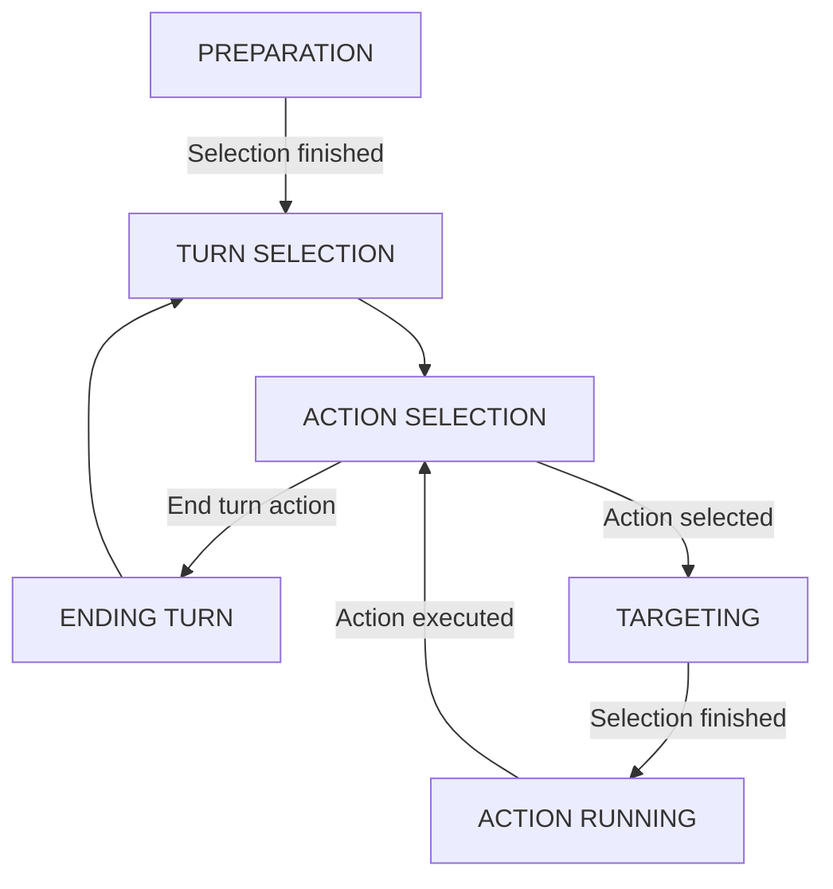

---
tags:
  - mechanical/combat
  - gameplay_design
---
## Features 
- [[Unit]]s make the core of the combat and should be the ones deciding victory at all times.
- Terrain exists to limit [[Unit]] movement. It should take at least 3 turns to reach the end of the map. 
- **TODO:** Events can happen during combat which will be telegraphed in some way. These influence how the combat is carried out and the player is warned before combat about them.

## States
- **PREPARATION:** **TODO** Allows selecting the [[Unit]]s that will participate and their position. The party screen is also available from here. Once exited, pass onto TAKING TURN
- **TURN SELECTION:** Gets the [[Unit]] with the lowest delay and makes them take their turn. Then moves onto AWAITING ACTION
- **ACTION SELECTION:** Updates the action buttons so the player can make an input. Once an action is selected, a new UsageParamaters is created and passes onto TARGETING. 
  If the action to end the turn is used, pass onto ENDING TURN instead.
- **ENDING TURN:** Loops until any left-over actions have finished running, then ends the current [[Unit]]'s turn and pass onto TAKING TURN so a new one can start.
- **[[Ability Usage|TARGETING]]:** See link. Once the targeting is done, pass onto ACTION RUNNING
- **ACTION RUNNING:** The action selected during TARGETING as well as any others that may be added to the queue as a result are ran in order. Then it returns to AWAITING ACTION

```mermaid
flowchart TD
A[PREPARATION]
B[TURN SELECTION]
C[ACTION SELECTION]
D[ENDING TURN]
E[TARGETING]
F[ACTION RUNNING]
A-->|Selection finished|B
B-->C
C-->|Action selected|E
C-->|End turn action|D
D-->B
E-->|Selection finished|F
F-->|Action executed|C
```
[[Combat balance]]